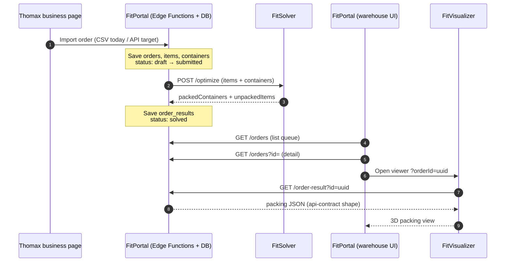
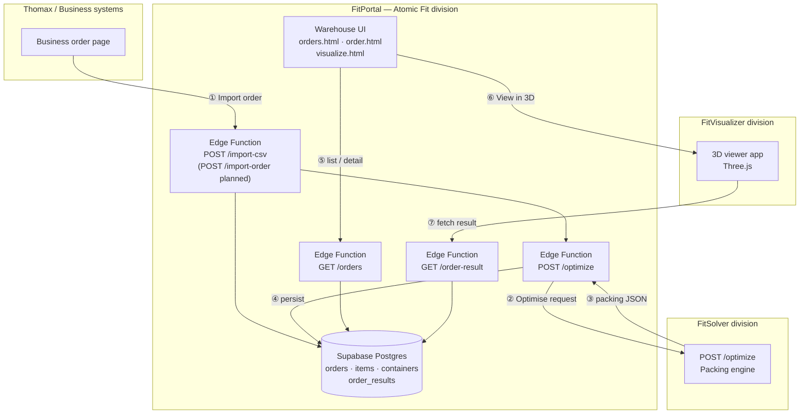
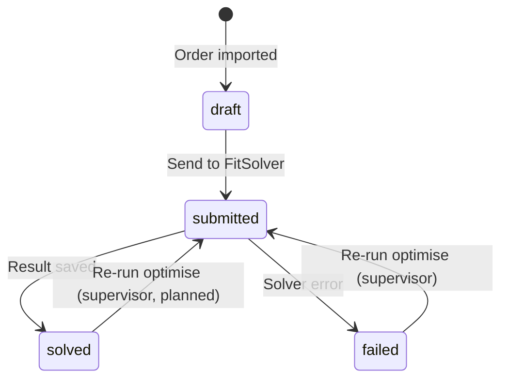

# Project Perfect Fit — End-to-End Process Architecture

> **Owner:** Atomic Fit division · **FitPortal sub-team**  
> **Audience:** FitSolver, FitVisualizer, Thomax / business systems, teaching staff  
> **Status:** Sprint 2 — core flow implemented; auth and production URLs pending  
> **Client:** Thomax · **Unit:** COMP4050

This document describes how the full system is **expected to work**, who owns each step,
and what each division must provide for integration to succeed.

---

## 1. System purpose

Project Perfect Fit helps warehouse staff pack orders into cartons efficiently.

| Division | Role |
|---|---|
| **Thomax / business systems** | Create packing orders (items + cartons) in existing business software |
| **FitPortal** (this team) | Import orders, run optimisation pipeline, store results, warehouse UI |
| **FitSolver** | Compute optimal 3D item placements inside cartons |
| **FitVisualizer** | Render the packing plan in an interactive 3D view for warehouse workers |

**Key principle:** FitPortal does **not** create orders. Warehouse workers **browse imported orders** and open **3D views** — they do not manually enter items on the floor.

---

## 2. Division responsibility matrix

| Capability | Thomax / Business | FitPortal | FitSolver | FitVisualizer |
|---|---|---|---|---|
| Create packing orders | ✅ Owns | — | — | — |
| Export / push orders to FitPortal | ✅ Owns | Receives | — | — |
| Store orders & results | — | ✅ Owns | — | — |
| Call packing engine | — | ✅ Owns (Edge Function) | Serves API | — |
| Packing algorithm | — | — | ✅ Owns | — |
| 3D rendering (Three.js) | — | — | — | ✅ Owns |
| Warehouse order queue UI | — | ✅ Owns | — | — |
| Auth for warehouse staff | — | ✅ Owns (planned) | — | — |
| Host solver API | — | — | ✅ Owns | — |
| Host viewer app | — | — | — | ✅ Owns |

**Hosting model:** Each division hosts its own service. FitPortal links or iframes FitVisualizer; FitPortal calls FitSolver server-side only (never from the browser).

---

## 3. End-to-end process (happy path)



### Step-by-step narrative

| Step | Actor | Action | Outcome |
|---|---|---|---|
| 1 | Thomax | Order created in business system with items + available cartons | Order exists upstream |
| 2 | Thomax → FitPortal | Order exported (CSV interim; JSON API target) | Rows in FitPortal DB |
| 3 | FitPortal | Edge Function builds `/optimize` payload | Request to FitSolver |
| 4 | FitSolver | Runs 3D bin packing | Placement JSON returned |
| 5 | FitPortal | Persists result; sets `orders.status = solved` | Ready for warehouse |
| 6 | Warehouse worker | Opens FitPortal order queue | Sees solved orders |
| 7 | Warehouse worker | Selects order → **View in 3D** | FitVisualizer opens |
| 8 | FitVisualizer | Fetches result by `orderId` | Renders packing plan |
| 9 | Warehouse worker | Packs physical cartons using 3D guide | Operational fulfilment *(out of scope for FitPortal status field today)* |

---

## 4. Architecture diagram



---

## 5. Integration touchpoints

Base URL (FitPortal): `{SUPABASE_URL}/functions/v1`  
Local dev default: `http://localhost:54321/functions/v1`

### 5.1 Thomax → FitPortal (order intake)

| | |
|---|---|
| **Today (testing)** | `POST /import-csv` — CSV upload |
| **Target** | `POST /import-order` — JSON from business page |
| **Spec** | `docs/import-contract.md` |
| **FitPortal expects** | `external_ref`, items (name, dimensions cm, weight kg, quantity), containers (name, dimensions cm, max weight kg) |

**FitPortal provides after import:** `orderId` (UUID), `external_ref`, `status` (`solved` or `failed`).

---

### 5.2 FitPortal → FitSolver (optimisation)

| | |
|---|---|
| **Endpoint** | `POST {FITSOLVER_URL}` — division provides base URL |
| **Called by** | FitPortal Edge Function only (not browser) |
| **Contract** | `docs/api-contract.md` |
| **SLA target** | Respond well under **60 seconds** |
| **Auth** | TBD — FitSolver to specify (API key / bearer token) |

**Request summary:** `orderId`, `items[]`, `containers[]` with explicit `cm` / `kg` units.

**Response summary:** `packedContainers[]` (placements + utilisation), `unpackedItems[]` (mandatory unhappy path).

**If `FITSOLVER_URL` unset:** FitPortal uses a mock solver for local development.

---

### 5.3 FitPortal → FitVisualizer (warehouse 3D view)

| | |
|---|---|
| **UI handoff** | `{FITVISUALIZER_URL}?orderId={uuid}` |
| **Embed option** | FitPortal `visualize.html` wraps viewer in iframe |
| **Data API** | `GET /order-result?id={uuid}` |
| **Contract** | Same JSON as FitSolver response — see `docs/api-contract.md` |

**FitVisualizer must:**

1. Accept `orderId` as a URL query parameter.
2. Call `GET /order-result?id={orderId}` (preferred — no DB credentials needed).
3. Render `packedContainers` using `items[]` and `containers[]` from the same response
   (lookup dimensions by `itemId` / `containerId`).
4. Surface `unpackedItems` if present.

**Container selection:** FitPortal sends available carton sizes; FitSolver picks which to use.

**Example result fetch:**

```http
GET https://<project>.supabase.co/functions/v1/order-result?id=<uuid>
```

```json
{
  "orderId": "uuid",
  "external_ref": "ORD-1042",
  "status": "solved",
  "items": [{ "id": "...", "dimensions": { "length": 20, "width": 15, "height": 10, "unit": "cm" }, "..." }],
  "containers": [{ "id": "...", "dimensions": { "length": 60, "width": 40, "height": 40, "unit": "cm" }, "..." }],
  "packedContainers": [ "..." ],
  "unpackedItems": [],
  "created_at": "2026-08-19T00:05:00Z"
}
```

---

## 6. Order status model

`orders.status` reflects the **optimisation pipeline** (not physical packing completion).



| Status | Visible to warehouse? | View in 3D? |
|---|---|---|
| `draft` | Optional (import in progress) | No |
| `submitted` | Yes | No |
| `solved` | Yes | **Yes** |
| `failed` | Yes | No (re-run needed) |

---

## 7. Data model (summary)

Full reference: `docs/database-schema.md`

```
orders (external_ref, status)
  ├── order_items → items (name, dimensions, weight)
  ├── order_containers → containers (name, dimensions, max_weight)
  └── order_results (packed_containers JSON, unpacked_items JSON)
```

Units stored as **`_cm`** and **`_kg`** in the database; FitSolver contract uses nested objects with explicit unit fields.

---

## 8. Implementation status (FitPortal)

| Component | Status |
|---|---|
| CSV import pipeline | ✅ Implemented |
| Thomax JSON import API | ⏳ Planned |
| FitSolver integration | ✅ Implemented (needs real URL) |
| Result persistence | ✅ Implemented |
| Warehouse order queue | ✅ Implemented |
| Order detail + search | ✅ Implemented |
| View in 3D handoff | ✅ Implemented |
| `/order-result` for FitVisualizer | ✅ Implemented |
| Auth + RLS | ⏳ Planned |
| Supervisor re-run optimise | ✅ Implemented (failed orders) |

---

## 9. What we need from each division

### Thomax / business systems

- [ ] Confirm export format (map to `docs/import-contract.md` JSON shape)
- [ ] Provide test orders for integration demo
- [ ] Define how `external_ref` is assigned (unique business key)

### FitSolver

- [ ] Dev / staging / prod URL for `POST /optimize`
- [ ] Auth scheme for server-to-server calls
- [ ] Confirm response matches `docs/api-contract.md`
- [ ] Answer open questions in `docs/api-contract.md`:
  - Rotation representation (degrees vs orientation index)
  - Container selection (solver picks vs pre-assigned)
  - Coordinate origin (`0,0,0` corner convention)
  - Error response shape for malformed vs unsolvable requests
- [ ] Confirm SLA / timeout (target: < 60s)

### FitVisualizer

- [ ] Dev / staging / prod viewer URL
- [ ] Confirm `?orderId=` query param contract
- [ ] Integrate `GET /order-result?id=` for packing data
- [ ] Confirm iframe embedding works (`visualize.html`)
- [ ] Confirm coordinate system matches FitSolver output
- [ ] Mobile / touch-friendly interaction for warehouse floor

---

## 10. Environment URL register

*Fill in as divisions provide endpoints.*

| Service | Dev URL | Staging URL | Prod URL | Owner |
|---|---|---|---|---|
| FitPortal UI | `localhost:3000` | TBD | TBD | FitPortal |
| FitPortal API | `localhost:54321/functions/v1` | TBD | TBD | FitPortal |
| FitSolver | TBD | TBD | TBD | FitSolver |
| FitVisualizer | TBD | TBD | TBD | FitVisualizer |

---

## 11. Shared contracts (do not change unilaterally)

| Document | Purpose |
|---|---|
| `docs/api-contract.md` | FitSolver request/response + FitVisualizer data shape |
| `docs/import-contract.md` | Order intake from Thomax |
| `docs/database-schema.md` | FitPortal storage model |
| `docs/api-endpoints.md` | FitPortal HTTP API reference |

**Change control:** API contract changes require sign-off from FitSolver and FitVisualizer.

**FitPortal contact for integration:** Michael Murimbechi (Correspondent) — see `about.html`.

---

## 12. Out of scope (by design)

- FitPortal creating orders via warehouse UI
- FitPortal hosting Three.js or the packing algorithm
- FitPortal marking orders "physically packed" *(may be a future Thomax requirement)*
- Consumer / storefront UX
- Cross-division deployment in a single repo

---

## 13. Local demo path (for division testing)

```bash
# FitPortal — Terminal 1
supabase start && supabase db reset
supabase functions serve import-csv orders order-result optimize

# FitPortal — Terminal 2
npx serve .
```

1. Open `/orders.html` → upload `samples/orders-import.csv`
2. Order appears as `solved` → open detail → **View in 3D**
3. FitVisualizer team: point app at `GET /order-result?id=<uuid>` with the returned `orderId`

---

*Last updated: Sprint 2 · Atomic Fit / FitPortal*
